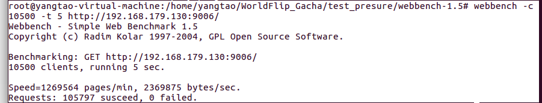

# WorldFlip_Gacha

基于C++的Linux世界弹射物语抽卡模拟器

- 使用 **线程池 + 非阻塞socket + epoll(ET和LT均实现) + 事件处理(Reactor和模拟Proactor均实现)** 的并发模型
- 使用**状态机**解析HTTP请求报文，能够根据服务器的请求做出正确响应
- **访问服务器数据库**实现用户的注册以及登陆，能够**保存抽卡记录**并**查看用户拥有的角色**
- 实现**同步/异步日志系统**，记录服务器运行状态
- 经Webbench压力测试可以实现**上万的并发连接**数据交换

## 功能展示

## Webbench压力测试结果

